# HAL OIMS — Entity Relationship Diagram
## Phase 2: Database Design

This document contains the complete ER diagram for the HAL Online Inventory Management System, generated using Mermaid notation.

---

## Core Schema Overview

| Table | Description | Rows (Est. Prod.) |
|-------|-------------|-------------------|
| users | System user accounts | ~200 |
| roles | RBAC role definitions | 10 |
| permissions | Granular module/action permissions | 96 |
| role_permissions | Role ↔ Permission junction | ~200 |
| departments | HAL divisions and departments | ~20 |
| designations | Job grades and designations | ~15 |
| employees | Employee profiles | ~200 |
| warehouses | Physical warehouses | ~10 |
| zones | Warehouse zones | ~50 |
| racks | Rack units inside zones | ~200 |
| shelves | Shelves on racks | ~800 |
| bins | Individual bins (most granular) | ~4000 |
| categories | Item top-level categories | ~15 |
| subcategories | Item subcategories | ~60 |
| manufacturers | Component manufacturers | ~50 |
| vendors | Supplier/vendor profiles | ~500 |
| vendor_contacts | Vendor contact persons | ~1000 |
| inventory_items | Master item catalogue | ~10000 |
| item_batches | Batch tracking records | ~50000 |
| item_serials | Serial number tracking | ~25000 |
| item_attachments | Item images and documents | ~30000 |
| stock_locations | Item-Warehouse-Bin mapping | ~20000 |
| purchase_requests | Internal purchase requests | ~5000 |
| purchase_request_items | PR line items | ~15000 |
| purchase_orders | Formal purchase orders | ~3000 |
| purchase_order_items | PO line items | ~10000 |
| goods_received_notes | GRN records | ~3000 |
| grn_items | GRN line items | ~9000 |
| invoices | Vendor invoices | ~3000 |
| stock_transactions | Immutable stock ledger | ~500000+ |
| work_orders | Production work orders | ~2000 |
| work_order_materials | BOM per work order | ~10000 |
| material_issues | Material issue vouchers | ~5000 |
| material_issue_items | Material issue line items | ~15000 |
| maintenance_schedules | Maintenance plans | ~1000 |
| calibration_records | Instrument calibration | ~5000 |
| repair_history | Equipment repair logs | ~2000 |
| notifications | System notification events | ~100000 |
| user_notifications | Per-user notification state | ~500000 |
| audit_logs | Immutable activity trail | ~10000000+ |
| settings | System configuration | ~50 |

---

## Full ER Diagram

```mermaid
erDiagram
    %% ── RBAC ──────────────────────────────────────────────────────────────
    users {
        uuid id PK
        varchar username UK
        varchar email UK
        varchar passwordHash
        varchar firstName
        varchar lastName
        enum status
        uuid roleId FK
        timestamp lastLoginAt
        timestamp createdAt
    }
    roles {
        uuid id PK
        enum name UK
        varchar displayName
        bool isSystem
    }
    permissions {
        uuid id PK
        varchar module
        varchar action
        varchar displayName
    }
    role_permissions {
        uuid id PK
        uuid roleId FK
        uuid permissionId FK
    }

    users }o--|| roles : "has role"
    roles ||--o{ role_permissions : "grants"
    permissions ||--o{ role_permissions : "assigned via"

    %% ── EMPLOYEES ─────────────────────────────────────────────────────────
    departments {
        uuid id PK
        varchar code UK
        varchar name
    }
    designations {
        uuid id PK
        varchar code UK
        varchar name
        varchar grade
    }
    employees {
        uuid id PK
        varchar employeeCode UK
        uuid userId FK
        uuid departmentId FK
        uuid designationId FK
        varchar firstName
        varchar lastName
        date dateOfJoining
    }

    users ||--o| employees : "linked to"
    departments ||--o{ employees : "belongs to"
    designations ||--o{ employees : "holds"

    %% ── WAREHOUSES ────────────────────────────────────────────────────────
    warehouses {
        uuid id PK
        varchar code UK
        varchar name
        enum type
        bool isActive
    }
    zones {
        uuid id PK
        uuid warehouseId FK
        varchar code
        varchar name
    }
    racks {
        uuid id PK
        uuid zoneId FK
        varchar code
        varchar name
    }
    shelves {
        uuid id PK
        uuid rackId FK
        varchar code
    }
    bins {
        uuid id PK
        uuid shelfId FK
        varchar code
        float maxWeight
    }

    warehouses ||--o{ zones : "contains"
    zones ||--o{ racks : "contains"
    racks ||--o{ shelves : "contains"
    shelves ||--o{ bins : "contains"

    %% ── CATEGORIES ────────────────────────────────────────────────────────
    categories {
        uuid id PK
        varchar code UK
        varchar name
    }
    subcategories {
        uuid id PK
        uuid categoryId FK
        varchar code UK
        varchar name
    }

    categories ||--o{ subcategories : "has"

    %% ── MANUFACTURERS & VENDORS ───────────────────────────────────────────
    manufacturers {
        uuid id PK
        varchar code UK
        varchar name
        enum country
    }
    vendors {
        uuid id PK
        varchar vendorCode UK
        varchar name
        varchar gstNumber UK
        enum status
        float performanceRating
    }
    vendor_contacts {
        uuid id PK
        uuid vendorId FK
        varchar name
        bool isPrimary
    }

    vendors ||--o{ vendor_contacts : "has"

    %% ── INVENTORY ─────────────────────────────────────────────────────────
    inventory_items {
        uuid id PK
        varchar itemCode UK
        varchar partNumber UK
        varchar name
        uuid categoryId FK
        uuid subcategoryId FK
        uuid manufacturerId FK
        uuid vendorId FK
        float currentQuantity
        float reservedQuantity
        float minimumStock
        float reorderLevel
        float purchaseCostInr
        bool isBatchTracked
        bool isSerialTracked
        bool isCritical
        enum status
    }
    item_batches {
        uuid id PK
        uuid itemId FK
        varchar batchNumber
        date expiryDate
        float quantity
    }
    item_serials {
        uuid id PK
        uuid itemId FK
        varchar serialNumber UK
        varchar status
    }
    item_attachments {
        uuid id PK
        uuid itemId FK
        varchar fileName
        varchar filePath
    }
    stock_locations {
        uuid id PK
        uuid itemId FK
        uuid warehouseId FK
        uuid binId FK
        float quantity
        bool isPrimary
    }

    categories ||--o{ inventory_items : "classified under"
    subcategories ||--o{ inventory_items : "sub-classified"
    manufacturers ||--o{ inventory_items : "manufactured by"
    vendors ||--o{ inventory_items : "supplied by"
    inventory_items ||--o{ item_batches : "tracked in batches"
    inventory_items ||--o{ item_serials : "tracked by serial"
    inventory_items ||--o{ item_attachments : "has files"
    inventory_items ||--o{ stock_locations : "stored at"
    warehouses ||--o{ stock_locations : "hosts"
    bins ||--o{ stock_locations : "bins"

    %% ── PURCHASE ──────────────────────────────────────────────────────────
    purchase_requests {
        uuid id PK
        varchar prNumber UK
        uuid requestedById FK
        enum status
        enum priority
        date requiredByDate
        uuid approvedById FK
    }
    purchase_request_items {
        uuid id PK
        uuid purchaseRequestId FK
        uuid itemId FK
        uuid vendorId FK
        float requiredQuantity
    }
    purchase_orders {
        uuid id PK
        varchar poNumber UK
        uuid purchaseRequestId FK
        uuid vendorId FK
        uuid createdById FK
        enum status
        float totalAmountInr
    }
    purchase_order_items {
        uuid id PK
        uuid purchaseOrderId FK
        uuid itemId FK
        float orderedQuantity
        float unitCostInr
        float totalCostInr
    }
    goods_received_notes {
        uuid id PK
        varchar grnNumber UK
        uuid purchaseOrderId FK
        uuid warehouseId FK
        enum status
        date receivedDate
    }
    grn_items {
        uuid id PK
        uuid grnId FK
        uuid itemId FK
        float receivedQty
        float acceptedQty
        float rejectedQty
    }
    invoices {
        uuid id PK
        varchar invoiceNumber
        uuid purchaseOrderId FK
        date invoiceDate
        float totalAmountInr
        enum status
    }

    users ||--o{ purchase_requests : "creates (PR)"
    users ||--o{ purchase_requests : "approves (PR)"
    purchase_requests ||--o{ purchase_request_items : "contains"
    purchase_request_items }o--|| inventory_items : "for item"
    purchase_request_items }o--|| vendors : "from vendor"
    purchase_requests ||--o{ purchase_orders : "converted to"
    purchase_orders }o--|| vendors : "sent to"
    users ||--o{ purchase_orders : "creates (PO)"
    purchase_orders ||--o{ purchase_order_items : "contains"
    purchase_order_items }o--|| inventory_items : "orders item"
    purchase_orders ||--o{ goods_received_notes : "received via"
    goods_received_notes ||--o{ grn_items : "contains"
    grn_items }o--|| inventory_items : "receives item"
    purchase_orders ||--o{ invoices : "invoiced by"

    %% ── STOCK TRANSACTIONS ────────────────────────────────────────────────
    stock_transactions {
        uuid id PK
        varchar transactionNumber UK
        enum type
        uuid itemId FK
        uuid fromWarehouseId FK
        uuid toWarehouseId FK
        float quantity
        float balanceBefore
        float balanceAfter
        uuid performedById FK
        timestamp createdAt
    }

    inventory_items ||--o{ stock_transactions : "moved via"
    users ||--o{ stock_transactions : "performed by"
    warehouses ||--o{ stock_transactions : "source warehouse"
    warehouses ||--o{ stock_transactions : "dest warehouse"

    %% ── PRODUCTION ────────────────────────────────────────────────────────
    work_orders {
        uuid id PK
        varchar woNumber UK
        varchar title
        enum status
        enum priority
    }
    work_order_materials {
        uuid id PK
        uuid workOrderId FK
        uuid itemId FK
        float requiredQty
        float issuedQty
    }
    material_issues {
        uuid id PK
        varchar issueNumber UK
        uuid workOrderId FK
        varchar status
    }
    material_issue_items {
        uuid id PK
        uuid materialIssueId FK
        uuid itemId FK
        float issuedQty
        float returnedQty
    }

    work_orders ||--o{ work_order_materials : "requires"
    work_order_materials }o--|| inventory_items : "uses item"
    work_orders ||--o{ material_issues : "issued via"
    material_issues ||--o{ material_issue_items : "contains"
    material_issue_items }o--|| inventory_items : "issues item"

    %% ── MAINTENANCE ───────────────────────────────────────────────────────
    maintenance_schedules {
        uuid id PK
        varchar scheduleNumber UK
        varchar assetCode
        enum status
        date scheduledDate
        date nextDueDate
    }
    calibration_records {
        uuid id PK
        varchar recordNumber UK
        uuid maintenanceId FK
        varchar instrumentCode
        date nextCalibrationDate
        enum result
    }
    repair_history {
        uuid id PK
        varchar repairNumber UK
        uuid maintenanceId FK
        varchar assetCode
        date repairDate
        float costInr
    }

    maintenance_schedules ||--o{ calibration_records : "records"
    maintenance_schedules ||--o{ repair_history : "logs"

    %% ── NOTIFICATIONS ─────────────────────────────────────────────────────
    notifications {
        uuid id PK
        enum type
        varchar title
        enum severity
        timestamp createdAt
    }
    user_notifications {
        uuid id PK
        uuid userId FK
        uuid notificationId FK
        bool isRead
    }

    notifications ||--o{ user_notifications : "delivered to"
    users ||--o{ user_notifications : "receives"

    %% ── AUDIT ─────────────────────────────────────────────────────────────
    audit_logs {
        uuid id PK
        uuid userId FK
        enum action
        varchar module
        varchar entityType
        varchar entityId
        varchar description
        json oldValues
        json newValues
        varchar ipAddress
        timestamp createdAt
    }

    users ||--o{ audit_logs : "generates"
```

---

## Key Design Decisions

### 1. UUID Primary Keys
All tables use UUID (`@default(uuid())`) instead of integer sequences to support:
- Distributed inserts without conflicts
- Predictable IDs in API payloads
- Future horizontal scaling

### 2. Soft Deletes
All master data tables include `deletedAt DateTime?`. Records are never hard-deleted, preserving audit trails and foreign key integrity.

### 3. Immutable Ledgers
`stock_transactions` and `audit_logs` are append-only — no update or delete operations are permitted at the application layer. This ensures complete financial and operational traceability.

### 4. Denormalized Quantity Snapshots
`stock_transactions.balanceBefore` and `balanceAfter` are denormalized snapshots recorded at write time. This allows instant ledger reconstruction without expensive aggregation queries.

### 5. Multi-Location Stock
`stock_locations` supports an item existing in multiple warehouses, zones, and bins simultaneously. The `isPrimary` flag identifies the default storage location.

### 6. Batch & Serial Tracking
`item_batches` and `item_serials` are separate child tables, enabling items to be tracked at the batch or individual unit level depending on the `isBatchTracked` / `isSerialTracked` flags on the parent item.

### 7. JSON Audit Columns
`audit_logs.oldValues` and `newValues` store full JSON snapshots of changed records, enabling complete before/after comparison without joining historical tables.

### 8. Role-Based Permission System
Permissions are defined as `module × action` pairs and assigned to roles through the `role_permissions` junction table. This allows fine-grained, per-module access control without hardcoding permissions in application code.

---

## Index Strategy

| Table | Indexed Columns | Reason |
|-------|----------------|--------|
| users | username, email, roleId, status | Login lookup, role filtering |
| inventory_items | itemCode, partNumber, categoryId, name, status | Search, filter, reorder checks |
| stock_transactions | itemId, type, performedById, createdAt | Ledger queries, reporting |
| purchase_orders | poNumber, vendorId, status, orderDate | PO tracking |
| audit_logs | userId, action, module, createdAt | Audit trail queries |
| item_batches | itemId, batchNumber, expiryDate | Expiry alerts |
| item_serials | serialNumber, status | Serial lookup |
| calibration_records | instrumentCode, nextCalibrationDate | Calibration due alerts |
| maintenance_schedules | status, scheduledDate, assetCode | Overdue detection |